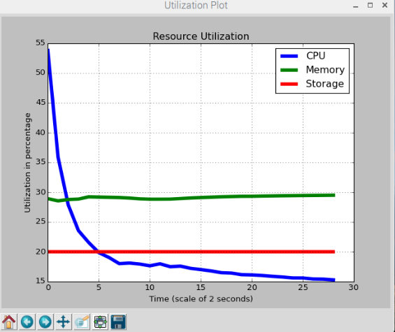

### This is a property of London South Bank University Developed by Emeka
# URU (Unix Resource Utilization)

* This python application monitors the resource utilization of any unix system
* Please run the setup.sh script as super user before use
* It plots the moving average of the CPU, RAM and Storage of the Unix over time

